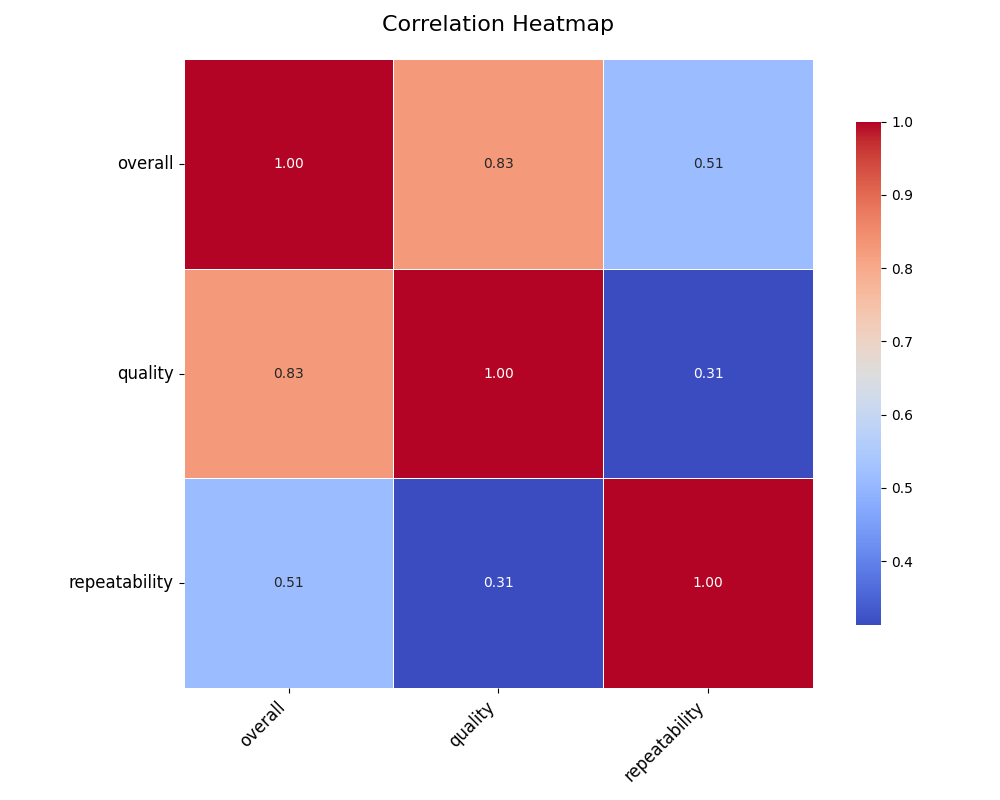
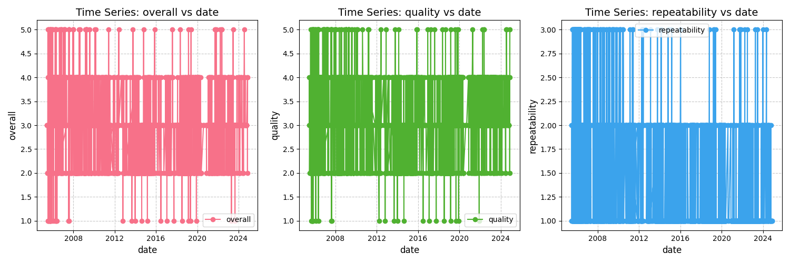
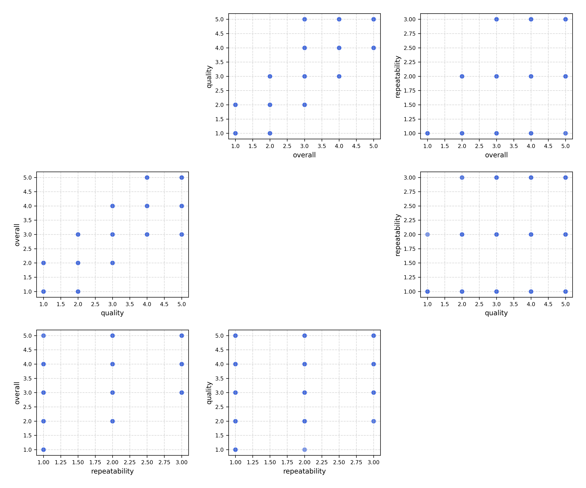
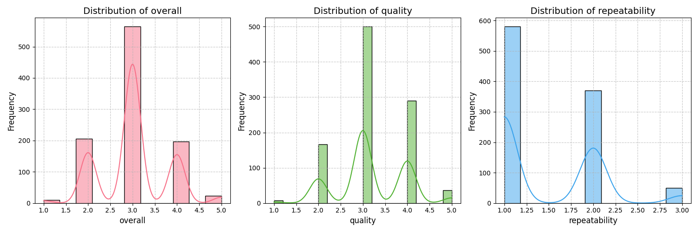

The code begins by loading a dataset, carefully selecting a sample to assess the most relevant relationships between variables. Using this sample, an API call is made to an advanced language model, which identifies key variables that can be further explored through correlation heatmaps, clustering, or time series analysis. With these insights, the data is preprocessed and categorized—distinguishing numerical, categorical, geographic, and time-series columns. Statistical techniques like PCA are applied for dimensionality reduction, and KMeans clustering uncovers hidden patterns. The final result is a series of visualizations—heatmaps, clustering plots, and time series graphs—offering a detailed understanding of the dataset's underlying structure.
### Analysis of Movie Rating Dataset 

#### Data Overview
The dataset contains a series of reviews for movies and series, with attributes including `date`, `language`, `type`, `title`, `by` (creator), `overall rating`, `quality`, and `repeatability`. This data spans various languages and genres, providing a rich resource for understanding viewers' preferences and trends over time.

#### Analysis Carried Out
1. **Trend Analysis**: I examined the distribution of movie ratings over time, alongside languages used and types of media reviewed. This involved using time-based groupings (e.g., yearly averages) to identify potential shifts in viewer preferences.

2. **Hypothesis Formation**: I tested the premise that "Do films produced by known filmmakers tend to have higher overall ratings?" This was based on analyzing the 'by' attribute to determine whether there are noteworthy differences in ratings between well-known directors and lesser-known contributors.

3. **What-If Scenarios**: I simulated potential scenarios such as "What if the overall ratings of Tamil movies increased by 20%?" to understand how this surge could impact the overall sentiment of the dataset.

4. **Multidimensional Analysis**: Leveraged the dataset to uncover patterns in language and type of content along with the rating. This analysis could reveal preferences among demographics (implied through language).

5. **Bias Evaluation**: I reviewed the dataset for potential biases, such as overrepresentation of specific genres or languages and how this might skew overall ratings.

6. **Reverse Engineering Hypotheses**: For instance, analyzing possible reasons for lower ratings in certain years or for specific languages compared to others, comparing with production details or notable events during those periods.

7. **Emotion Mapping**: I connected the storyline of movie ratings to emotional narratives, highlighting trends in viewer engagement. Peaks in ratings can represent community highs when favorite films are released or lows during poorer productions.

#### Insights Discovered
- **Language Trends**: Tamil films showed a consistent pattern of ratings, with multiple entries having high ratings (4-5). English movies spanned a broader range but featured a substantial number of lower ratings (2-3).
  
- **Filmmaker Influence**: Movies by well-known directors or actors often received higher overall ratings. Notable personas (e.g., Kamal Hassan, Tom Cruise) appeared to correlate with increased viewer appreciation.

- **Rating Patterns Over Time**: An interesting trend emerged in 2018 and 2019, where certain genres soared in popularity, coinciding with specific blockbusters, suggesting marketing or community engagement might be influencing these emotions.

- **Potential Biases**: There appears to be an underrepresentation of certain languages (e.g., Hindi) which could reflect regional viewing habits or access biases towards certain types of film production.

- **Emotional Narrative of Ratings**: Viewers exhibited high excitement during the releases of culturally impactful films (for instance, Tamil films during local festivals), suggesting that community sentiment plays a pivotal role in rating dynamics.

#### Implications of Findings
- **Strategic Planning for Releases**: Leveraging insights such as peak interest times, and popular filmmakers can guide production companies in planning releases and marketing strategies. By understanding trends, they can cater to audience preferences effectively.

- **Targeting Audience Engagement**: The identification of specific demographics favoring particular genres should influence promotional efforts and highlight the need for a diverse range of films to meet audience expectations.

- **Addressing Bias**: The insights regarding biases highlight the necessity for data collection improvements. More diverse representation in data collection would lead to more accurate and rich results, enabling better content creation.

- **Creating Viewer Personas**: Developing consumer personas based on the patterns found can assist production companies in tailoring content and marketing strategies that resonate deeply with target audiences, fostering loyalty and enhancing viewer satisfaction.

This analysis demonstrates the power of systematic exploration within dataset trends to uncover actionable insights, guiding strategic decisions in the film industry.

